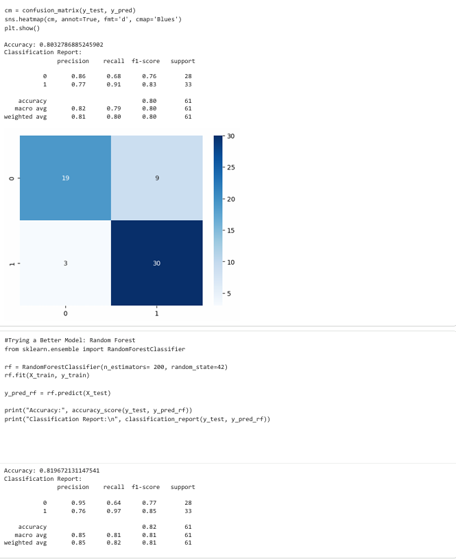

# heart-disease-classification

This project predicts the presence of heart disease using machine learning models.

## Project Steps
- Data loading
- Exploratory Data Analysis (EDA)
- Train/test split
- Logistic Regression model
- Random Forest model
- Evaluation (accuracy, precision, recall, F1-score, confusion matrix)

## Tech Stack
Python, pandas, NumPy, scikit-learn, Matplotlib, Seaborn

## How to Run
1. Install dependencies:
   pip install -r requirements.txt
2. Open the notebook and run all cells.
   
## 📊 Model Results

Below is the confusion matrix and accuracy output from the final model:

